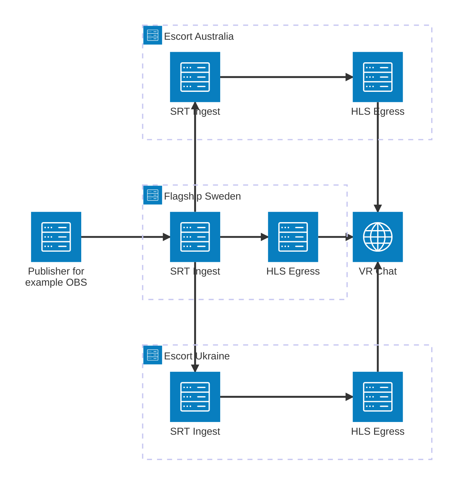

<p align="center">
  
</p>

<h1 align="center">VRC-Haven</h1>

<p align="center">
  <b>A CDN video streaming system build for easy deployment.</b>
</p>

<p align="center">
  <a href="https://goreportcard.com/report/github.com/OverlayFox/VRC-Haven"></a>
  <a href="https://github.com/OverlayFox/VRC-Haven/actions/workflows/go.yml"></a>
</p>

## 1. Table of Contents

- [1. Table of Contents](#1-table-of-contents)
- [2. Introduction](#2-introduction)
- [3. Features](#3-features)
- [4. Architecture](#4-architecture)
- [5. Prerequisites](#5-prerequisites)
- [6. Installation](#6-installation)
  - [6.1. MaxMind Database Setup](#61-maxmind-database-setup)
- [7. Usage](#7-usage)
  - [7.1. Running as Flagship](#71-running-as-flagship)
  - [7.2. Running as Escort](#72-running-as-escort)
- [8. Roadmap](#8-roadmap)
- [9. Contributing](#9-contributing)
- [10. License](#10-license)
- [11. Acknowledgments](#11-acknowledgments)

## 2. Introduction

VRC-Haven is a distributed content delivery network designed for publishing HLS signals to the web. <br>
It enables multiple users to work together as a "Haven", automatically routing viewers to the geographically closest user for optimal stream stability and reduced latency.

> ⚠️ **Early Development Notice**: This project is currently in pre-alpha stage. Expect bugs and missing features.

## 3. Features

- **Distributed CDN Architecture**: Multiple users work together to serve streams efficiently
- **Intelligent Geographic Routing**: Automatically routes viewers to the nearest available server
- **SRT to HLS Conversion**: Receives SRT feeds and remuxes to HLS for web delivery
- **Lightweight & Efficient**: Minimal resource footprint using native Go libraries with minimal external software dependencies\*
- **Self-Hosted**: Full control over your streaming infrastructure

> \*:This system relies on MaxMinds GeoIP database which is free to download from MaxMinds website. See [6. Installation](#6-installation) for more information.

## 4. Architecture

VRC-Haven uses a hub-and-spoke model with two types of servers:

**Haven Overview:**



The Escorts will pull the SRT feed from the Flagship and convert them each to HLS. <br>
The flagship will then redirect the clients from inside VRC to the closest escort available or itself.

## 5. Prerequisites

- Windows or Linux PC
- Network infrastructure capable of SRT/RTSP streaming
- Router access to forward TCP/UDP Ports
- A Free MaxMind account

## 6. Installation

### 6.1. MaxMind Database Setup

VRC-Haven uses the `MaxMind GeoLite2-City Databse`for IP geolocation to calculate distances between servers and viewers.

This step is mandatory to use this application and is completely free.

**Setup Steps:**

1. Create a free account at [MaxMind](https://www.maxmind.com/en/geolite2/signup)
2. Navigate to the `Manage license keys` page
3. Click on `Generate new license key` - This is free to do
4. Give it a unique name
5. Once created, copy the `Account ID` and `License key`
6. Add your key to the config file:
   ```
   MaxMindAccountID=YOUR_ACCOUNT_ID_HERE
   MaxMindLicenseKey=YOUR_KEY_HERE
   ```

The application will automatically check for and download database updates on startup.

> **Note**: The database is not included in the repository due to licensing restrictions.

## 7. Usage

### 7.1. Running as Flagship

```bash
./VRC-Haven flagship [options]
```

### 7.2. Running as Escort

```bash
./VRC-Haven escort --flagship-url=<url> --passphrase=<secret> [options]
```

_(Full command-line documentation coming soon)_

## 8. Roadmap

- [x] Proof of Concept
- [x] Code refactoring for improved readability and maintainability
- [x] Better circular buffering
- [x] MPEG-TS Demuxing
- [x] RTSP Muxing
- [x] Move from RTSP to HLS due to VRC not implementing RTSP return codes
- [ ] Allow only a certain amount of viewers per node
- [ ] Syncing between SRT-Servers and HLS clients
- [ ] Pirate Mode - allows server to only broadcast the HLS signal on LAN
- [ ] SRT chaining - allows nodes to pull SRT streams from other nodes
- [ ] Web interface for monitoring
- [ ] When a escort disconnects the readers shouldn't be dropped but redirected to a different escort

## 9. Contributing

Contributions are welcome! <br>
Please feel free to open issues or submit pull requests.

## 10. License

This project is licensed under the terms specified in the [LICENSE](LICENSE) file.

## 11. Acknowledgments

- [MaxMind](https://www.maxmind.com) for providing the geolocation database
